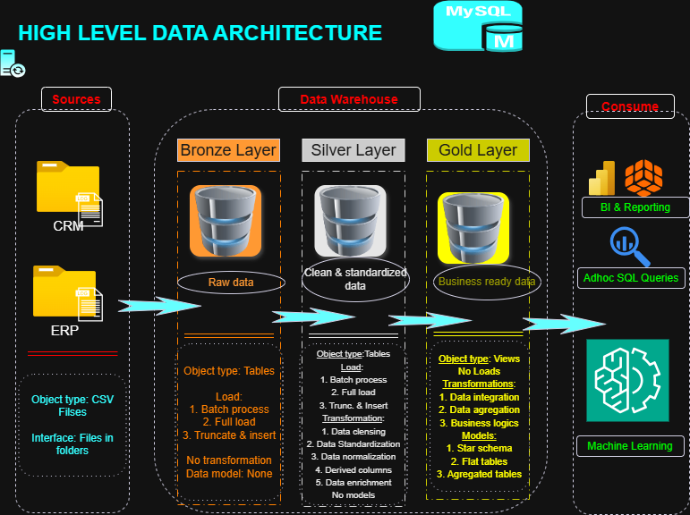
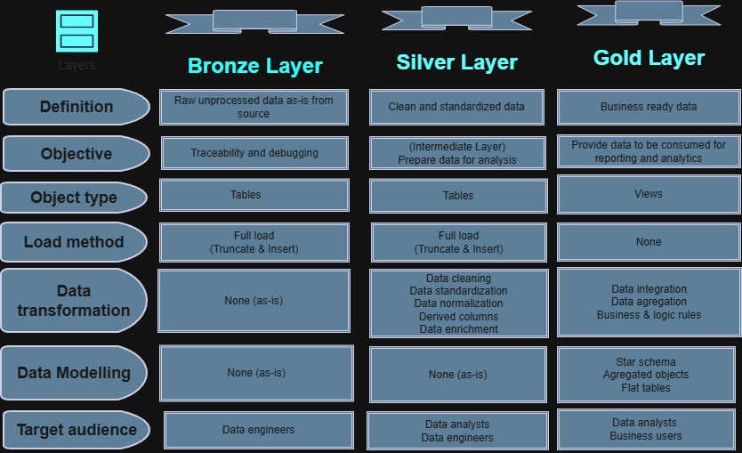

# Data Warehouse & Analytics Project: End-to-End SQL Implementation

Welcome to the **Data Warehouse and Analytics Project** repository. This project demonstrates a comprehensive, end-to-end data engineering and analytics solution—from architectural design and ETL to generating actionable business insights. 

This repository serves as a portfolio piece highlighting industry best practices in data warehousing, including the **Medallion Architecture** and cross-dialect SQL implementation.

---

## 🏗️ High-Level Architecture
This project follows the **Medallion Architecture** (Bronze, Silver, Gold layers) to ensure data quality and traceability:
* **Bronze (Raw):** Landing zone for unprocessed data from ERP and CRM source systems.
* **Silver (Cleaned):** Standardized, cleansed, and validated data.
* **Gold (Curated):** Business-ready data modeled into Fact and Dimension tables for reporting.

  ## 🏗️ High-Level Architecture

*Figure 1: Architectural design created in draw.io*

  ## 🏗️ Project layers

*Figure 2: These are the layers in the project created in draw.io*

### 🛠️ Technical Stack & Adaptation
* **Database Engine:** MySQL 8.0+
* **Source Data:** CSV (ERP & CRM systems)
* **SQL Dialect:** Ported from T-SQL (SQL Server) to MySQL.
* **Key Challenge:** This project was originally designed for SQL Server. I have successfully translated the architecture, stored procedures, and schema logic into **MySQL**, demonstrating deep understanding of cross-platform SQL dialects.

  ## 🛠️ Setup & Prerequisites
To run this project locally, you need:
* **MySQL 8.0.40**
* **Local Infile Enabled:** Due to security restrictions in MySQL 8.0+, you must enable `local_infile` to load the CSV datasets.

### 🚀 Troubleshooting "Secure File Priv" Errors
If you encounter **Error 3948** or **Error 1290** during the Bronze layer load, follow these steps:
1. **Server-side:** Run `SET GLOBAL local_infile = 1;` in your SQL editor.
2. **Client-side (MySQL Workbench):** 
   - Edit your Connection -> Advanced -> Others.
   - Add `OPT_LOCAL_INFILE=1`.
3. **Relaunch:** You must close and reopen the connection for changes to take effect.

### 🛠️ Tools & Technologies
* **Design:** draw.io (Used for architectural diagrams and data modeling)
* **Planning:** Notion (Used for project tracking, task management, and documentation)
* **Version Control:** Git & GitHub
  
---

## 🎯 Project Objectives

### 1. Data Engineering (The Warehouse)
* **Consolidation:** Integrate disparate data from ERP and CRM sources.
* **Quality Assurance:** Implement data cleansing and validation logic to resolve quality issues.
* **Integration:** Build a user-friendly star schema for analytical queries.
* **Efficiency:** Utilize Stored Procedures to automate the `Truncate & Insert` load method.

### 2. Data Analytics (Business Intelligence)
Develop SQL-based analytics to deliver insights into:
* **Customer Behavior:** Segmenting and identifying key customer patterns.
* **Product Performance:** Analyzing sales volume and revenue by category.
* **Sales Trends:** Tracking growth and seasonal variations.

---

## 📈 Project Roadmap & Progress
- [x] Environment Setup (MySQL Medallion Databases)
- [x] Database Schema Translation (T-SQL to MySQL)
- [x] Bronze Layer: Table Definition & Data Loading
- [ ] Silver Layer: Data Cleansing & Transformation
- [ ] Gold Layer: Dimensional Modeling (Facts/Dimensions)
- [ ] Business Analytics & Reporting

---

## 📜 License
This project is licensed under the [MIT License](LICENSE). You are free to use, modify, and share this with proper attribution.

## 👨‍💻 About the Author
I'm **Mohammed Alhassan**, a data professional and educator with over 9 years of experience. I specialize in automation and AI integration, with a focus on building scalable data solutions. My goal is to transition into a full-time Data Engineering role where I can combine my pedagogical background with robust technical architecture.
