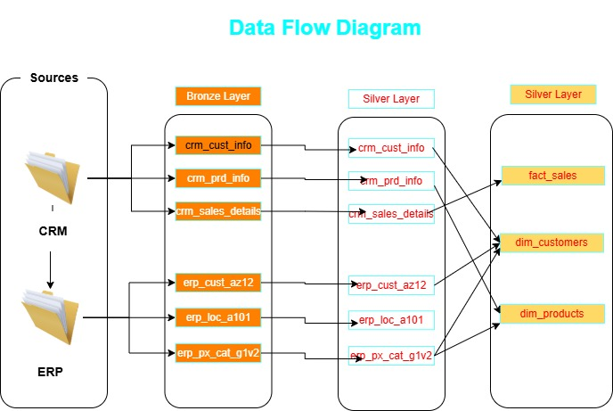
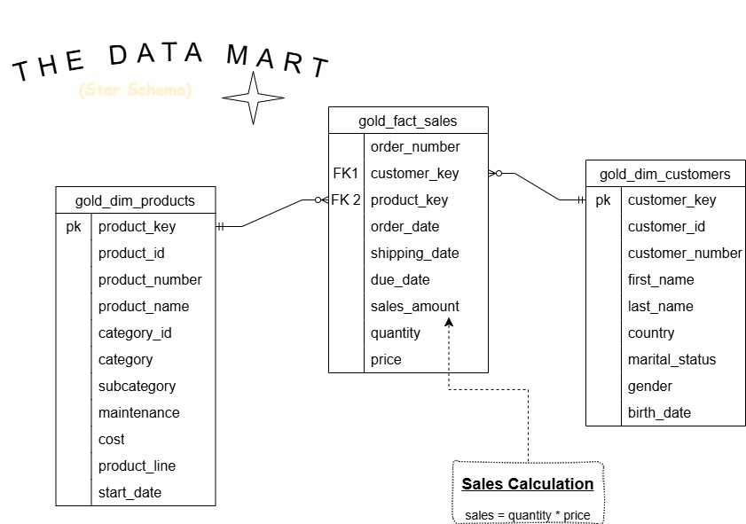

# Data Warehouse & Analytics Project: End-to-End SQL Implementation

Welcome to the **Data Warehouse and Analytics Project** repository. This project demonstrates a comprehensive, end-to-end data engineering and analytics solution—from architectural design and ETL to generating actionable business insights. 

This repository serves as a portfolio piece highlighting industry best practices in data warehousing, including the **Medallion Architecture** and cross-dialect SQL implementation.

---

## 🏗️ High-Level Architecture
This project follows the **Medallion Architecture** (Bronze, Silver, Gold layers) to ensure data quality and traceability:
* **Bronze (Raw):** Landing zone for unprocessed data from ERP and CRM source systems.
* **Silver (Cleaned):** Standardized, cleansed, and validated data.
* **Gold (Curated):** Business-ready data modeled into Fact and Dimension tables for reporting.

*Figure 1: Architectural design created in draw.io*

### 🔄 Data Flow & Lineage
Understanding how data moves from source systems into our final analytical views is key to the project's transparency.

*Figure 2: Data Flow Diagram illustrating the ETL journey from Sources to the Gold Layer*

### 🛠️ Project Layers

*Figure 3: Detailed breakdown of the project layers*

---

## 📐 Data Modeling (The Star Schema)
The **Gold Layer** is structured using a Star Schema design. This approach prioritizes query performance and ease of use for BI tools like Power BI or Tableau.

*Figure 4: The Data Mart (Star Schema) showing Fact and Dimension relationships*

---

## 🛠️ Technical Stack & Adaptation
* **Database Engine:** MySQL 8.0+
* **Source Data:** CSV (ERP & CRM systems)
* **SQL Dialect:** Ported from T-SQL (SQL Server) to MySQL.
* **Advanced SQL:** Window Functions (ROW_NUMBER), Common Table Expressions (CTEs), and Temporal Slicing.
* **Key Challenge:** This project was originally designed for SQL Server. I have successfully translated the architecture, stored procedures, and schema logic into **MySQL**, demonstrating deep understanding of cross-platform SQL dialects and syntax variations.

### 🚀 Setup & Prerequisites
To run this project locally, you need:
* **MySQL 8.0.40**
* **Local Infile Enabled:** Due to security restrictions in MySQL 8.0+, you must enable `local_infile` to load the CSV datasets.

#### Troubleshooting "Secure File Priv" Errors
If you encounter **Error 3948** or **Error 1290** during the Bronze layer load:
1. **Server-side:** Run `SET GLOBAL local_infile = 1;` in your SQL editor.
2. **Client-side (MySQL Workbench):** Edit your Connection -> Advanced -> Others -> Add `OPT_LOCAL_INFILE=1`.
3. **Relaunch:** You must close and reopen the connection for changes to take effect.

---

## 🎯 Project Objectives

### 1. Data Engineering (The Warehouse)
* **Consolidation:** Integrate disparate data from ERP and CRM sources.
* **Quality Assurance:** Implement data cleansing and validation logic to resolve quality issues.
* **Integration:** Build a user-friendly star schema for analytical queries.
* **Efficiency:** Utilize Stored Procedures to automate the `Truncate & Insert` load method.

### 2. Data Analytics (Business Intelligence)
Develop SQL-based analytics to deliver insights into:
* **Customer Behavior:** Segmenting and identifying key customer patterns.
* **Product Performance:** Analyzing sales volume and revenue by category.
* **Sales Trends:** Tracking growth and seasonal variations.

---

## 🛠️ Data Quality Challenges Resolved
During the transition from the Bronze to Silver layer, several critical data quality issues were identified and resolved:

1. **CRM System: Financial & Temporal Integrity**
    - **Zero & Invalid Dates:** Standardized legacy placeholder dates (e.g., 00000000) using `STR_TO_DATE` or setting them to `NULL`.
    - **Sales Math Reconciliation:** Implemented "self-healing" logic to recalculate `sales_amount` where it did not equal `Quantity × Price`.
    - **Division-by-Zero Protection:** Wrapped derived price calculations in `NULLIF` logic.

2. **ERP System: Structural Standardization**
    - **System Prefix Removal:** Stripped `NAS-` prefixes from IDs to enable seamless joins with CRM data.
    - **Logical Date Validation:** Audited birthdates against `CURRENT_DATE()` to remove future-dated records.
    - **ID Normalization:** Removed hyphens from IDs to create a unified primary key format.

3. **Data Enrichment & Categorization**
    - **Code-to-Text Mapping:** Mapped cryptic codes (e.g., 'DE', 'F') to descriptive labels ('Germany', 'Female').
    - **Whitespace Cleansing:** Applied `TRIM()` to all categorical strings to prevent join failures.

---

## 📈 Project Roadmap & Progress
- [x] Environment Setup (MySQL Medallion Databases)
- [x] Database Schema Translation (T-SQL to MySQL)
- [x] Bronze Layer: Table Definition & Data Loading
- [x] Silver Layer: Data Cleansing & Transformation
- [x] Gold Layer: Dimensional Modeling (Facts/Dimensions)
- [x] Business Analytics & Reporting

---

---

## 📊 Exploratory Data Analysis (EDA) & Insights
Following the construction of the Gold Layer, a comprehensive EDA was performed to audit data quality and extract business intelligence. 

**Key findings include:**
* **Revenue Drivers:** The 'Bikes' category dominates the business, accounting for **96% of total revenue**.
* **Regional Intelligence:** Australia represents the highest revenue density, yielding **2x the revenue per customer** compared to the United States.
* **Data Quality Audit:** Identified a **5% variance** in customer reporting due to SCD (Slowly Changing Dimension) Type 2 duplicates in the source ingestion.

> 📂 **View the full analysis:** For the complete SQL scripts and detailed business report, visit the [EDA Folder](./eda/).

---

## 🌟 Credits & Acknowledgments
This project was inspired by the comprehensive Data Warehouse tutorial by **Baraa Khatib Salkini** (Data with Baraa). 

While the original tutorial utilized **SQL Server (T-SQL)**, I have adapted the entire codebase, architecture, and logic to **MySQL**. This conversion required significant technical adjustments to stored procedures, window functions, and data loading methods, showcasing my ability to work across different database ecosystems.

---

## 📜 License
This project is licensed under the [MIT License](LICENSE). 

## 👨‍💻 About the Author
I'm **Mohammed Alhassan**, a Data Scientist and Professional Educator based in Ghana. I specialize in bridging the gap between complex data engineering and actionable business strategy.
